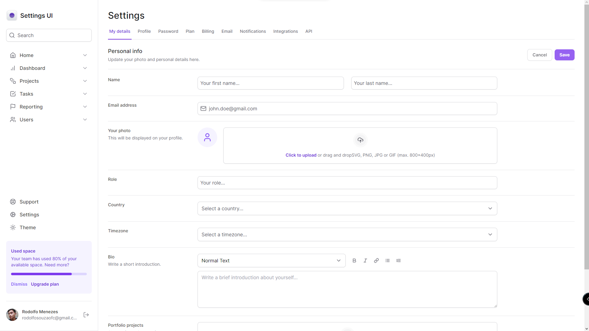

# Settings UI
Atualizando os conhecimentos em NextJS e TailwindCSS:

- Responsividade (Mobile First)
- Dark Mode
- Animações
- Acessibilidade (RadixUI)
- Pattern de Composição

Tecnologias usadas: NextJS, ReactJS, TailwindCSS e Typescript

DEPLOY: [CLIQUE PARA VER O PROJETO](https://settings-responsive-ui.vercel.app)



## Manual de uso
### Inicialiando o site - [http://localhost:3000/](http://localhost:3000/)
```sh
npm install
```
```sh
npm run dev
```